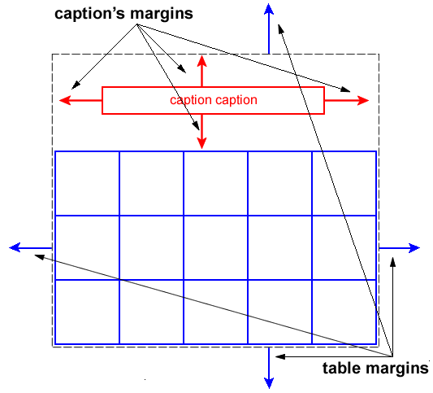
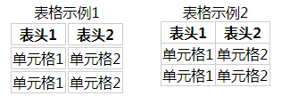

### CSS 表格

HTML中，专门用来创建表格的标签多得吓人，而最常用的有 `<table>`、`<caption>`、`<thead>`、`<tbody>`、`<tr>`、`<th>`、`<td>` 这 7 个标签。

`<table>` 标签用于定义一个表格；`<caption>` 标签用于定义表格的大标题，习惯放在表格定义的第一行，即紧随 `<table>` 标签；`<tr>` 标签用来定义表格的行；`<th>` 标签用于定义行或列的名称，即表头，其中的内容默认会加粗居中显示；`<td>` 标签用于定义表格的单元格，来存放表格的数据。

为了方便控制样式，一般把表头放在 thead 元素中，表格正文放在 tbody 元素中。代码如下：


<!--sec data-title="实例" data-filename="css_table" ces-->
```html
<table>
<caption>HTML表格示例</caption>
       <thead>
 <tr>
          <th>表头1</th>
          <th>表头2</th>
       </tr>
       </thead>
       <tbody>
       <tr>
          <td>单元格1</td>
          <td>单元格2</td>
       </tr>
       <tr>
          <td>单元格1</td>
          <td>单元格2</td>
       </tr>
       </tbody>
</table>
```
<!--endsec-->

如需在 CSS 中设置表格边框，请使用 border 属性。

下面的例子为 table、th 以及 td 设置了蓝色边框：

<!--sec data-title="实例" data-filename="css_table_border" ces-->
```css
table, th, td
  {
  border: 1px solid blue;
  }
```
<!--endsec-->

请注意，上例中的表格具有双线条边框。这是由于 table、th 以及 td 元素都有独立的边框。

如果需要把表格显示为单线条边框，请使用 border-collapse 属性。

## 表格的基本布局

在可视化模型中，一个表格既可以生成块级框（display:table），也可以生成行内级框（display:inline-table），默认生成块级框。

无论是块级框，还是行内级框，table元素都会生成一个主框，其中包含一个 table 框和一个 caption 框。如下图所示：



上图中，灰色虚线框的区域为 table元素形成的主框，蓝色区域为 table 框，红色区域为 caption 框，它们是两个独立的框，有各自独立的盒属性，如 marging、border等。主框的外边距，由 table元素 margin 属性定义。

## 表格的样式属性

表格中的每个单元格，都是盒模型中一个独立的盒子，并生成一个矩形框。因此，盒模型中几乎所有的属性，如边框、内边距、背景、对齐方式、文本、字体等，都适用于单元格的 td 元素。但有一点除外，外边距属性对 td 元素无效，相邻单元格之间的距离，是通过 border-spacing属性进行调整，而不是外边距属性。

在CSS2中，为表格定义了 5 个专用的属性，分别为 table-layout属性、caption-side属性、border-spacing属性、empty-cells属性 和 border-collapse属性，CSS3中未新增属性。

### table-layout

table-layout属性来定义表格的布局算法，取值为 auto | fixed，默认值为 auto。auto 表示自动布局，fixed 表示固定布局。

使用自动布局时，表格的布局是由浏览器根据各单元格的内容自动计算得到，列的宽度是由列单元格中，没有折行的最宽内容设定。由于需要在所有单元格的内容读取计算之后，才能确定最终布局，所以渲染速度较慢。

使用固定布局时，水平布局仅取决于表格宽度、列的宽度、表格边框宽度、单元格间距，而与单元格的内容无关。浏览器接收到第一行数据后，就可以确定布局，所以渲染速度较快。因此，最好是通过表头 th 元素的 width 属性，来设置列的宽度。

当然，根据应用的需要，也可以只设置其中某些列的宽度。这样的话，设置了固定宽度的列将采用固定布局，而没有设置固定宽度的列将采用自动布局。无论怎样，只要有一个列设置了固定宽度，表格的 table-layout 属性就必须设置为 fixed。如，有以下表格：

<!--sec data-title="实例" data-filename="css_table1" ces-->
```html
<table>
<caption>2015年销售额</caption>
<thead>
    <tr>
        <th>年</th>
        <th>季度</th>
        <th>销售额（万元）</th>
        <th>说明</th>
    </tr>
</thead>
<tbody>
    <tr>
        <th>2015</th>
        <th>1</th>
        <th>1895.26</th>
        <th>...</th>
    </tr>
    <tr>
        <th>2015</th>
        <th>2</th>
        <th>3456.84</th>
        <th>...</th>
    </tr>
    <tr>
        <th>2015</th>
        <th>3</th>
        <th>4857.69</th>
        <th>...</th>
    </tr>
    <tr>
        <th>2015</th>
        <th>4</th>
        <th>8941.82</th>
        <th>...</th>
    </tr>
</tbody>
</table>
```
<!--endsec-->

由于表格的第 1、2、3 列的内容比较明确，其宽度也相对固定。因此，就可以设置这三列的宽度，来采用固定布局，而不设置第 4 列的宽度，让它采用自动布局：

<!--sec data-title="实例" data-filename="css_table_layout" ces-->
```css
table {
    width: 100%;
    border-spacing: 0;
    table-layout: fixed;
    border-collapse: collapse;
}
th:nth-child(1),
th:nth-child(2) {
   width: 40px;
}
th:nth-child(3) {
   width: 120px;
}
```
<!--endsec-->

上述表格中，由于第 1、2、3 列设置了固定宽度，表格的 table-layout属性就必须设置为 fixed。

由于表格的宽度设置为百分比，表格就会随着浏览器窗口自动缩放（当然，还需要祖先元素采用流式布局），第 4 列也就会随之缩放。但无论怎么缩放，第 1、2、3 列的宽度始终保持不变。

### caption-side

caption-side属性用来定义caption框的显示位置。默认值情况下，caption 框显示在表格的上方，可以把 caption-side属性设置为 bottom 让它显示在表格的下方。

### border-spacing

border-spacing属性用来定义相邻单元格的边框之间的距离，默认值为0。使用长度值定义，不允许使用负值。该属性需要两个长度值，第一个用于水平间距，第二个用于垂直间距。如果只提供一个长度值，则同时用于水平间距和垂直间距。

需要注意的是，只有在 border-collapse属性取值为 separate 时，该属性才会有效。并且，该属性是应用于表格本身，而不是单元格。如果为 td 元素声明 border-spacing属性，则会被浏览器忽略。

### empty-cells

empty-cells属性用来定义当表格的单元格无内容时，是否显示该单元格的边框，取值为hide | show，默认值为show。只有在border-collapse属性取值为separate时，该属性才会有效。

如果该属性设置为show，则会绘制空单元格的边框和背景，就好像该单元格有内容一样。如果值为 hide，则不会绘制该单元格的边框和背景，就好像该单元格被设置为 visibility: hidden 一样。

如果一个单元格包含有内容，则不能认为是空的。这里的内容除了文本、图像、表格等，还包括不间断空格（&nbsp;）、以及除回车、换行、空格符以外的所有其它空白符。如果一行中的所有单元格都为空，而 empty-cells 的值为 hide，则该行的高度为 0，就好像这个整行被设置为 display: none 一样。

### border-collapse

border-collapse属性用来定义单元格边框的显示方式，取值为 separate | collapse，默认值为 separate。separate 表示各单元格有独立的边框，collapse 表示相邻单元格的边框被合并为一个边框。

边框独立时，不会忽略 border-spacing属性和 empty-cells属性；边框合并时，则会忽略 border-spacing属性和 empty-cells属性。如：

<!--sec data-title="实例" data-filename="css_table_border-collapse" ces-->
```css
.separate {
    border-collapse: separate;
    border-spacing: 2px;
}
.collapse {
    border-collapse: collapse;
}

th, td {
    border: 1px solid #ccc;
}
```
<!--endsec-->



上图中，左侧表格采用独立边框，右侧表格采用合并边框。为了清楚可见，为单元格定义1px的灰色边框，即每个单元格各自有1px的边框。独立边框还定义了2px的边框间隙。

可以看出，左侧表格单元格的边框各自独立，单元格之间的距离为各自边框及边框间距之和，即1px + 2px + 1px = 4px；而右侧表格单元格边框被合并成了一个边框，并忽略了边框间隙，最终边框宽度依然为1px。
