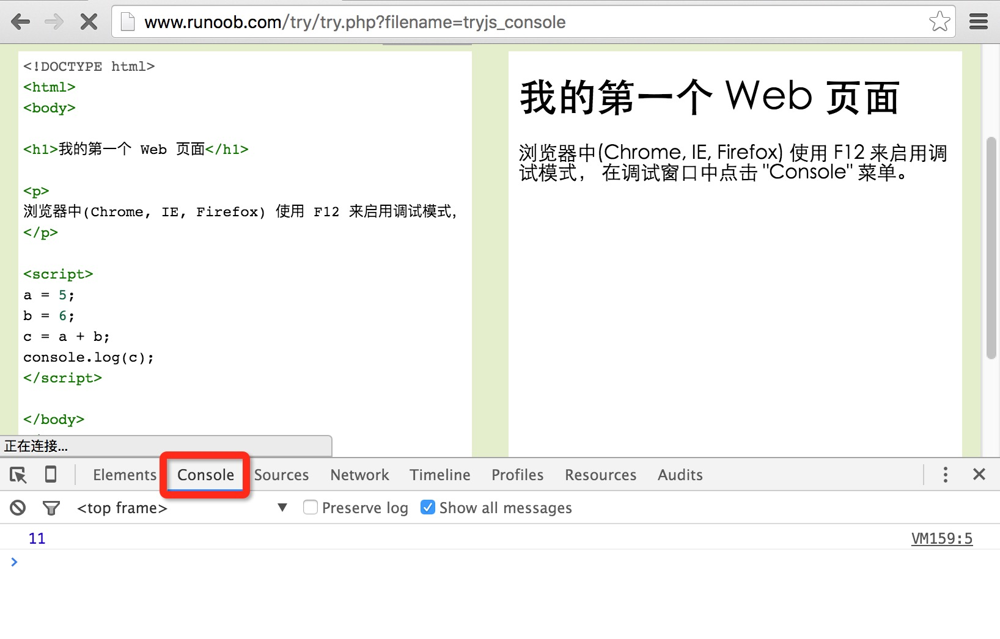

# JavaScript 输出

JavaScript 没有任何打印或者输出的函数。

## JavaScript 显示数据

JavaScript 可以通过不同的方式来输出数据：

- 使用 **window.alert()** 弹出警告框。
- 使用 **document.write()** 方法将内容写到 HTML 文档中。
- 使用 **innerHTML** 写入到 HTML 元素。
- 使用 **console.log()** 写入到浏览器的控制台。

## 使用 window.alert()

你可以弹出警告框来显示数据：

<!--sec data-title="实例" data-filename="js_output_alert" ces-->
```html
<!DOCTYPE html>
<html>
<body>

<h1>我的第一个页面</h1>
<p>我的第一个段落。</p>

<script>
window.alert(5 + 6);
</script>

</body>
</html>
```
<!--endsec-->

## 操作 HTML 元素

如需从 JavaScript 访问某个 HTML 元素，您可以使用 document.getElementById(id) 方法。

请使用 "id" 属性来标识 HTML 元素，并 innerHTML 来获取或插入元素内容：

<!--sec data-title="实例" data-filename="js_dom" ces-->
```html
<!DOCTYPE html>
<html>
<body>

<h1>我的第一个 Web 页面</h1>

<p id="demo">我的第一个段落</p>

<script>
document.getElementById("demo").innerHTML = "段落已修改。";
</script>

</body>
</html>
```
<!--endsec-->

以上 JavaScript 语句（在 `<script`> 标签中）可以在 web 浏览器中执行：

**document.getElementById("demo")** 是使用 id 属性来查找 HTML 元素的 JavaScript 代码 。

**innerHTML = "段落已修改。"** 是用于修改元素的 HTML 内容(innerHTML)的 JavaScript 代码。

## 在本教程中

在大多数情况下，在本教程中，我们将使用上面描述的方法来输出：

上面的例子直接把 id="demo" 的 `<p>` 元素写到 HTML 文档输出中：

## 写到 HTML 文档

出于测试目的，您可以将JavaScript直接写在HTML 文档中：

<!--sec data-title="实例" data-filename="js_write" ces-->
```html
<!DOCTYPE html>
<html>
<body>

<h1>我的第一个 Web 页面</h1>

<p>我的第一个段落。</p>

<script>
document.write(Date());
</script>

</body>
</html>
```
<!--endsec-->

> [!TIP]
> 请使用 document.write() 仅仅向文档输出写内容。
> 如果在文档已完成加载后执行 document.write，整个 HTML 页面将被覆盖。

<!--sec data-title="实例" data-filename="js_write_over" ces-->
```html
<!DOCTYPE html>
<html>
<body>

<h1>我的第一个 Web 页面</h1>

<p>我的第一个段落。</p>

<button onclick="myFunction()">点我</button>

<script>
function myFunction() {
   	document.write(Date());
}
</script>

</body>
</html>
```
<!--endsec-->

## 写到控制台

如果您的浏览器支持调试，你可以使用 **console.log()** 方法在浏览器中显示 JavaScript 值。

浏览器中使用 F12 来启用调试模式， 在调试窗口中点击 "Console" 菜单。

<!--sec data-title="实例" data-filename="js_console" ces-->
```html
<!DOCTYPE html>
<html>
<body>

<h1>我的第一个 Web 页面</h1>

<script>
a = 5;
b = 6;
c = a + b;
console.log(c);
</script>

</body>
</html>
```
<!--endsec-->

实例 console 截图：



## 您知道吗? 

> [!TIP]
> 程序中调试是测试，查找及减少bug(错误)的过程。